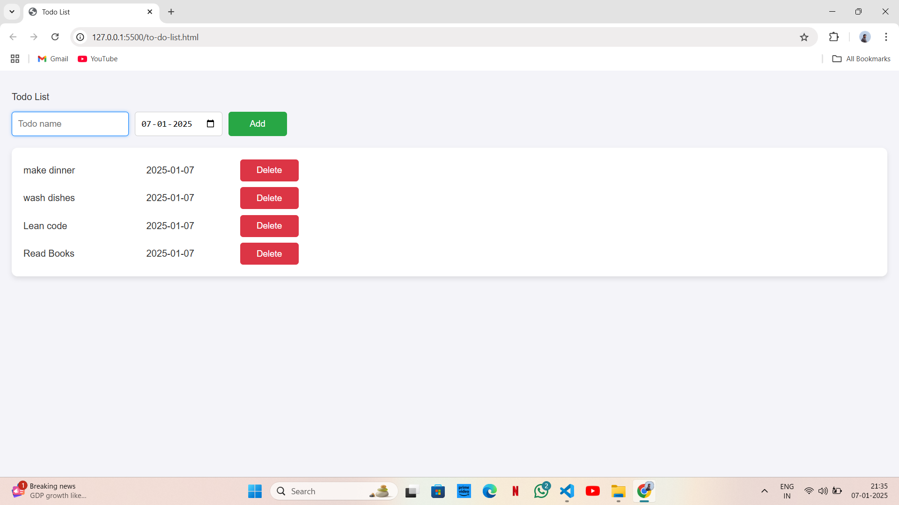

# To-Do-List
## Overview
This is a simple To-Do List web application built using HTML, CSS, and JavaScript.
## Features
- Add Tasks: Easily add new tasks to the list.
- Delete Tasks: Remove tasks from the list.
## Technologies Used
- HTML
- CSS
- JavaScript
## Screenshots
Here is a screenshot of the To-Do List interface.

